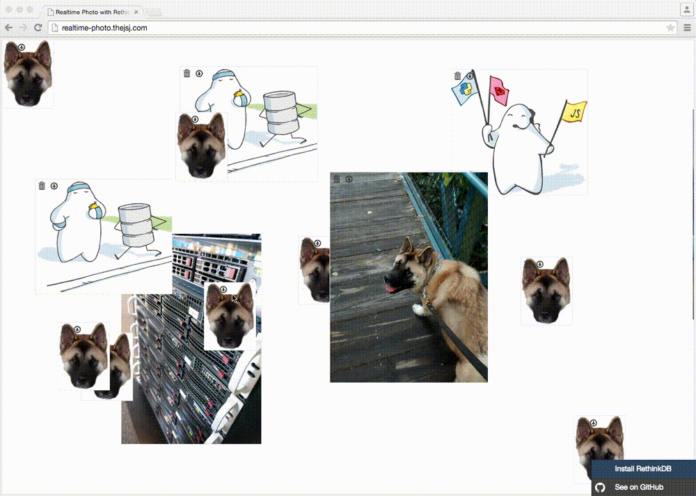

# Realtime Photo Sharing



A realtime photo sharing whiteboard made with [RethinkDB](http://rethinkdb.com)

### Setup

Install all packages:

```
npm install
bower install
```
Build front-end:
```
npm run build
```

If you want to run it using nodemon (for development):
```
npm run dev
```
If you want to run it in production:
```
npm start
```

You can also run it using a docker container
```
fig -f dev.yml build
fig -f dev.yml up
```
